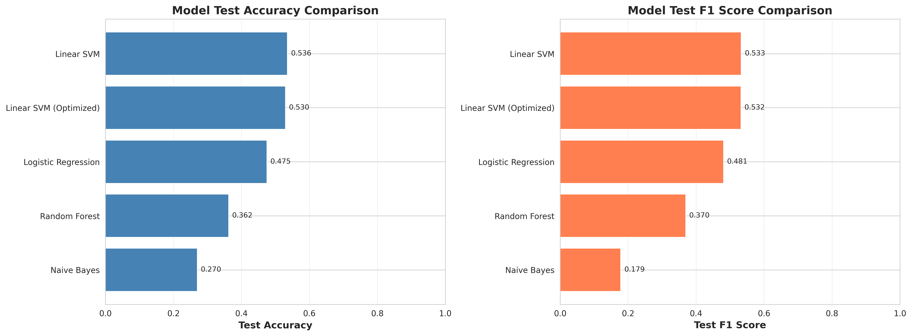
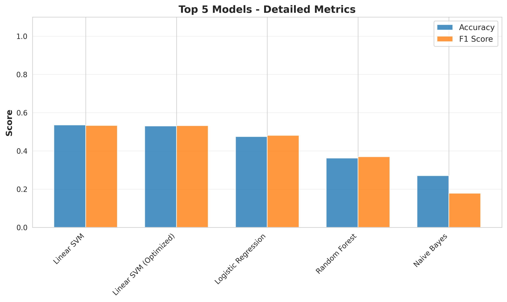
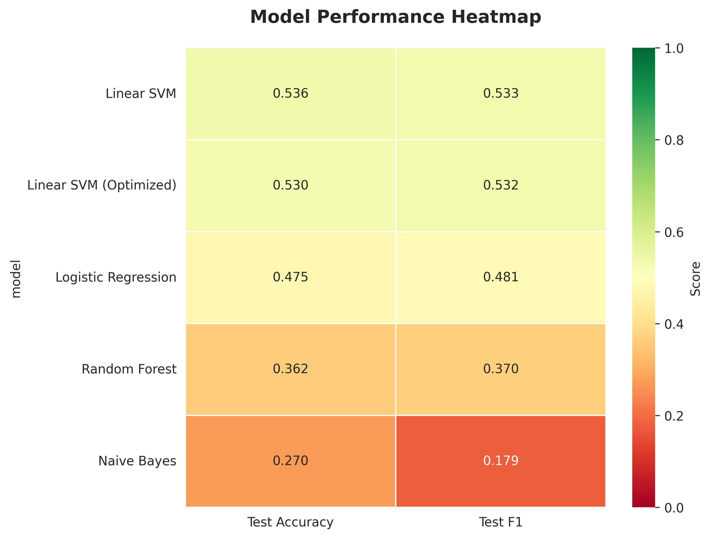

# 📊 Book Genre Classifier - Model Results Report

**Generated:** 2026-02-09 16:14:06

**Total Models Trained:** 5

---

## 🎯 Executive Summary

### Best Model: **Linear SVM**
- **Test Accuracy:** 0.5356 (53.56%)
- **Test F1 Score:** 0.5332

### Worst Model: **Naive Bayes**
- **Test Accuracy:** 0.2702 (27.02%)
- **Test F1 Score:** 0.1786

**Performance Range:** 98.2% improvement from worst to best model

---

## 📈 Model Comparison

*Figure 1: Test accuracy and F1 score comparison across all models*

## 🏆 Top 5 Models

*Figure 3: Detailed metrics for the best performing models*

| Rank | Model | Test Accuracy | Test F1 | Status |

|------|-------|---------------|---------|--------|

| 🥇 1 | Linear SVM | 0.5356 | 0.5332 | ✓ |

| 🥈 2 | Linear SVM (Optimized) | 0.5298 | 0.5324 | ✓ |

| 🥉 3 | Logistic Regression | 0.4750 | 0.4812 | ✓ |

| ⭐ 4 | Random Forest | 0.3625 | 0.3698 | ✓ |

| ⭐ 5 | Naive Bayes | 0.2702 | 0.1786 | ✓ |

## 🌡️ Performance Heatmap

*Figure 4: Heatmap visualization of model performance metrics*

## 📋 Detailed Results

| Model | Train Acc | Test Acc | Test F1 | Overfitting Gap |

|-------|-----------|----------|---------|----------------|

| Linear SVM | N/A | 0.5356 | 0.5332 |  |

| Linear SVM (Optimized) | N/A | 0.5298 | 0.5324 |  |

| Logistic Regression | N/A | 0.4750 | 0.4812 |  |

| Random Forest | N/A | 0.3625 | 0.3698 |  |

| Naive Bayes | N/A | 0.2702 | 0.1786 |  |

## 💡 Recommendations

### For Production Use:

1. **Primary Model:** Use **Linear SVM** (highest accuracy)
2. **Ensemble:** Combine top 3-5 models with voting for robustness
3. **Ensemble Strategy:** Top models have similar performance - use weighted voting

### To Improve Performance:

- **Data Augmentation:** Generate synthetic samples for underrepresented genres
- **Feature Engineering:** Add more domain-specific features
- **Hyperparameter Tuning:** Run grid search on top 3 models
- **Cross-Validation:** Verify results with k-fold cross-validation

### Model-Specific Insights:

- **Feature-based models** average: 0.3625

## 📊 Dataset Information

- **Training samples:** 3080
- **Validation samples:** 660
- **Test samples:** 660
- **Total samples:** 4400

### Genre Distribution (Training Set):

- **Politics:** 294 (9.5%)
- **Cooking & Drinking:** 292 (9.5%)
- **Engineering & Technology:** 284 (9.2%)
- **Science-Fiction & Fantasy:** 282 (9.2%)
- **Biographies:** 280 (9.1%)
- **Adventure:** 278 (9.0%)
- **History - Other:** 278 (9.0%)
- **Poetry:** 278 (9.0%)
- **Children & Young Adult Reading:** 275 (8.9%)
- **Romance:** 274 (8.9%)
- **Crime, Thrillers & Mystery:** 265 (8.6%)

---

*Report generated automatically by `visualize_results.py`*

*Models saved in: `/home/kasia/ML/book-genre-classifier/models_saved`*

*Results saved in: `results`*